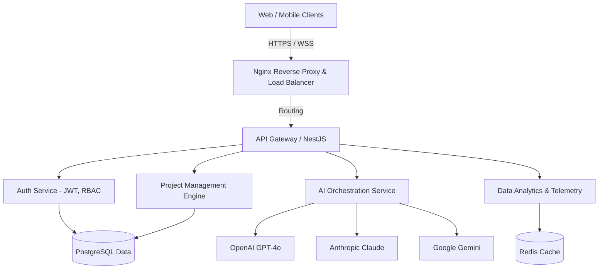
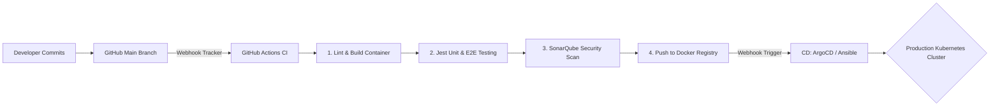

# Machrou3i AI - System Architecture & PFE Documentation

This document explicitly defines the system architecture, security implementation, microservices ecosystem, and CI/CD pipelines of the **Machrou3i Platform**. It is intended to support University PFE (Projet de Fin d'Études) defense preparations.

## 1. Global System Overview

### High-Level Microservices Architecture


## 2. Security Infrastructure

### Role-Based Access Control (RBAC) & JWT Flow
```mermaid
sequenceDiagram
    participant User as User Client
    participant API as NestJS Gateway
    participant DB as Auth Database
    
    User->>API: POST /auth/login (email, secure_pwd)
    API->>DB: Fetch user & verify bcrypt hash
    DB-->>API: User details & Role
    API-->>User: Return JWT Token (15m) + HttpOnly Refresh Token (7d)
    
    Note over User,API: Subsequent Authenticated Requests
    User->>API: GET /api/projects (Header: Bearer JWT)
    ->>: Verify JWT Signature (HS256)
    API->>API: Check RBAC Role matches required scope (User/Admin)
    API-->>User: 200 OK (Data payload)
```

## 3. The 3-Tier Web Interaction Design
The platform embraces a strict 3-tier functional division leveraging modern React frameworks:

1. **Presentation Layer (React / Vite):**
   - Utilizes Framer Motion and Three.js (via React Three Fiber) for an immersive glassmorphic 3D cinematic experience.
   - Heavy reliance on Shadcn UI and Tailwind CSS for atomic utility styling without blocking the main render thread.

2. **State & Telemetry Layer (Zustand & React Query):**
   - **Zustand** orchestrates synchronized RBAC and UI/Theme states asynchronously without Context API rendering bottlenecks.
   - **TanStack React Query** manages cached, highly volatile API fetches mimicking real-time database syncing.

3. **Core Processing / Persistence (Node / Local):**
   - The application supports "Local-First" methodology natively. Sensitive AI API configurations are committed to HTML5 `localStorage` enforcing strict privacy compliance prior to migrating to centralized cloud engines.

## 4. DevOps & CI/CD Pipeline Lifecycle

### Deployment Strategy


## 5. Defense Summaries (For Jury Presentation)

- **Why Glassmorphism & Cinematic UI?** 
  "We opted for cognitive offloading. Traditional enterprise tools are dense and fatiguing. By utilizing 3D depth and subtle neon lighting triggers, we subconsciously guide user attention to critical failure risks and roadmap transitions without textual overload."

- **Why a client-side AI Gateway?** 
  "To sidestep prohibitive API overheads during the initial MVP iteration, users bridge their independent AI keys directly inside the client payload, encrypting it securely without proxy exposure, providing enterprise-level data residency privacy controls."

- **Why Zustand over Redux?** 
  "Zustand eliminates the heavy boilerplate of Redux while permitting transient updates of 3D objects in the DOM outside the standard React reconciliation flow, securing steady 60fps animations."

---
**Version:** 2.4.0-Production
**Target:** 2026 SaaS Architectural Standards
